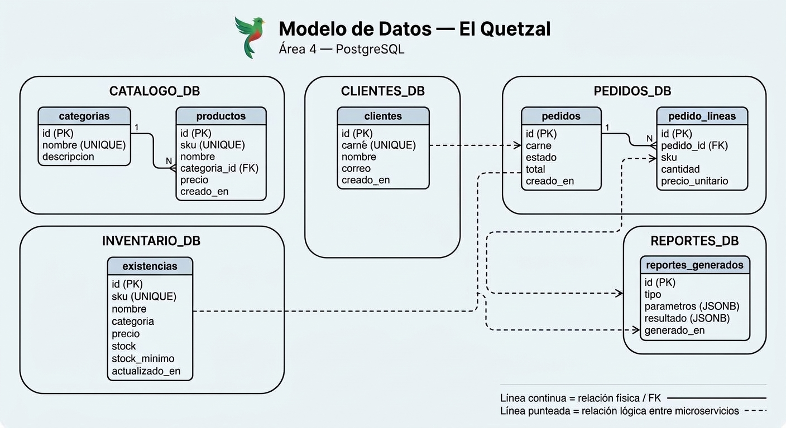

# Modelo de datos — Área 4

El sistema utiliza un solo motor PostgreSQL con cinco bases de datos independientes, una por microservicio. Cada base posee su propio usuario para mantener aislamiento lógico y aplicar el principio de menor privilegio.

Los esquemas se encuentran separados en:

- `db/schemas/catalogo.sql`
- `db/schemas/inventario.sql`
- `db/schemas/clientes.sql`
- `db/schemas/pedidos.sql`
- `db/schemas/reportes.sql`

## Bases de datos y usuarios

| Base | Usuario | Tablas |
|---|---|---|
| `catalogo_db` | `catalogo_user` | `categorias`, `productos` |
| `inventario_db` | `inventario_user` | `existencias` |
| `clientes_db` | `clientes_user` | `clientes` |
| `pedidos_db` | `pedidos_user` | `pedidos`, `pedido_lineas` |
| `reportes_db` | `reportes_user` | `reportes_generados` |

## Modelo por microservicio

### catalogo_db

Tabla `categorias`

- `id` — PK
- `nombre` — único y obligatorio
- `descripcion`

Tabla `productos`

- `id` — PK
- `sku` — único y obligatorio
- `nombre`
- `categoria_id` — FK hacia `categorias.id`
- `precio`
- `creado_en`

Catálogo conserva la información descriptiva de categorías y productos.

### inventario_db

Tabla `existencias`

- `id` — PK
- `sku` — único y obligatorio
- `nombre`
- `categoria`
- `precio`
- `stock`
- `stock_minimo`
- `actualizado_en`

`inventario_db.existencias` es la fuente oficial para consultar precio y stock durante la creación de pedidos.

### clientes_db

Tabla `clientes`

- `id` — PK
- `carne` — único y obligatorio
- `nombre`
- `correo`
- `creado_en`

Esta tabla contiene los seis integrantes del grupo. Los carnés se cargan automáticamente mediante `db/seeds/clientes.sql`.

### pedidos_db

Tabla `pedidos`

- `id` — PK
- `carne`
- `estado`
- `total`
- `creado_en`

Tabla `pedido_lineas`

- `id` — PK
- `pedido_id` — FK hacia `pedidos.id`
- `sku`
- `cantidad`
- `precio_unitario`

La relación entre `pedidos` y `pedido_lineas` sí utiliza una foreign key porque ambas tablas pertenecen a la misma base de datos.

El campo `carne` no posee foreign key hacia `clientes_db` y el campo `sku` no posee foreign key hacia `inventario_db`, porque pertenecen a bases de datos independientes. Estas relaciones se validan mediante los microservicios.

### reportes_db

Tabla `reportes_generados`

- `id` — PK
- `tipo`
- `parametros` — JSONB
- `resultado` — JSONB
- `generado_en`

El servicio de reportes consulta Inventario y Pedidos para calcular las métricas del dashboard y almacena el resultado generado en esta tabla.

## Relaciones

Relaciones internas de base de datos:

`catalogo_db`

categorias
    |
    | 1:N
    v
productos

`pedidos_db`

pedidos
    |
    | 1:N
    v
pedido_lineas

Relaciones lógicas entre microservicios:

clientes_db.clientes
        |
        | carné
        v
pedidos_db.pedidos

inventario_db.existencias
        |
        | SKU / precio / stock
        v
pedidos_db.pedido_lineas

inventario_db + pedidos_db
        |
        | métricas
        v
reportes_db.reportes_generados

Las relaciones entre bases distintas son lógicas y se realizan mediante llamadas entre microservicios, no mediante foreign keys de PostgreSQL.

## Regla crítica: reserva y descuento atómico de stock

El stock vive únicamente en `inventario_db.existencias`.

Cuando el servicio Pedidos recibe un pedido:

1. Pedidos solicita una reserva al servicio Inventario mediante `POST /reservas`.
2. Inventario inicia una transacción.
3. Inventario realiza `SELECT ... FOR UPDATE` sobre los productos solicitados.
4. Valida que todos los productos tengan stock suficiente.
5. Si alguna cantidad no está disponible, se realiza `ROLLBACK`, se responde HTTP 409 y no se modifica ningún producto.
6. Si todos los productos tienen disponibilidad, se descuenta el stock y se realiza `COMMIT`.
7. Pedidos guarda el pedido y sus líneas en `pedidos_db`.
8. Si el guardado del pedido falla después de reservar el stock, Pedidos solicita una compensación mediante `POST /reservas/liberar`.

De esta forma el descuento de inventario es atómico: nunca se descuenta solamente una parte de los productos de un mismo pedido.

La compensación permite recuperar el stock si ocurre un error después de que Inventario haya confirmado la reserva.

## Persistencia

PostgreSQL utiliza el volumen nombrado:

`elquetzal_pgdata`

El volumen mantiene las cinco bases y sus datos aunque los contenedores sean eliminados mediante:

`docker compose down`

Para eliminar completamente la información y forzar una nueva inicialización se utiliza:

`docker compose down -v`

La persistencia fue comprobada eliminando y recreando el contenedor sin eliminar el volumen y verificando que los registros continuaban disponibles.

## Aislamiento

Cada microservicio utiliza un usuario independiente:

- `catalogo_user`
- `inventario_user`
- `clientes_user`
- `pedidos_user`
- `reportes_user`

Cada usuario es propietario de su propia base y sus tablas.

Se comprobó que un usuario puede consultar sus propias tablas, pero recibe `permission denied` al intentar consultar tablas pertenecientes a otra base.

## Inicialización

La inicialización se realiza automáticamente cuando PostgreSQL crea un volumen nuevo.

El orden es:

1. `01-crear-bases.sh`
   - crea las cinco bases;
   - crea los cinco usuarios;
   - asigna permisos.

2. `02-aplicar-esquemas-y-seeds.sh`
   - aplica cada archivo de `db/schemas` sobre su base correspondiente;
   - aplica los datos iniciales de `db/seeds`.

La inicialización completa fue comprobada eliminando el volumen y levantando nuevamente PostgreSQL desde cero.

## Evidencia personalizada

Los seis carnés del grupo están sembrados en `clientes_db.clientes`.

Estos datos deben permanecer visibles posteriormente en la interfaz y en los pedidos para cumplir con la evidencia personalizada solicitada en el proyecto.

## Diagrama ER

El diagrama ER final debe representar por separado las cinco bases de datos y diferenciar:

- relaciones físicas mediante foreign keys dentro de una misma base;
- relaciones lógicas entre microservicios.

## Diagrama ER

El modelo de datos se representa en el siguiente diagrama:

El diagrama separa las cinco bases de datos del sistema.

- Las líneas continuas representan relaciones físicas mediante foreign keys dentro de una misma base de datos.
- Las líneas punteadas representan relaciones lógicas entre microservicios y no foreign keys de PostgreSQL.